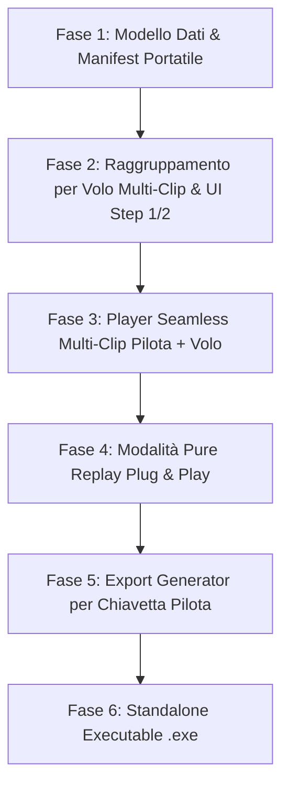

# SIV Video Analyzer - Roadmap Consolidata e Piani di Sviluppo

Questo documento unifica, consolida e riorganizza tutti i piani di sviluppo del progetto **SIV Video Analyzer**, allineandoli alle reali esigenze didattiche dell'istruttore sul campo e alla portabilità su chiavetta USB / multi-computer.

---

## 🎯 Visione Operativa del Progetto

1. **In Volo / Tra i Voli (Debriefing Immediato)**:
   - Zero tempi morti: nessun montaggio video obbligatorio o render lungo.
   - I video della scheda SD vengono catalogati istantaneamente per **Pilota** e per **Numero di Volo** (`Volo 1`, `Volo 2`, ...).
   - **Multi-Clip per Volo**: lo stesso volo può contenere **più clip video consecutive** (es. telecamera accesa/spenta dall'operatore a terra o file splittati a 4GB dalle action-cam come FAT32). Il software le gestisce come un unico volo unificato senza richiedere il rendering.
   - L'istruttore apre il player, seleziona il pilota e il volo appena atterrato e revisiona le manovre con i capitoli già indicizzati.
2. **Portabilità Assoluta (Plug & Play su Chiavetta USB / Altro PC)**:
   - La cartella di output contiene il manifesto del corso (`corso_siv_manifest.json`) con anagrafica piloti, vele e colori.
   - Tutte le trascrizioni e i capitoli sono memorizzati all'interno dell'output: aprendo la chiavetta su un altro PC, tutto è immediatamente pronto senza ri-trascrivere l'audio con Whisper.
3. **Fine Giornata / Fine Corso (Export per i Piloti)**:
   - Produzione su chiavetta dei video per i piloti:
     - Singoli video per ciascun volo (unendo le eventuali multi-clip di quel volo, con capitoli e sottotitoli).
     - Oppure video Master montato con cartelli grafici di transizione tra i voli e sovraimpressione delle manovre.

---

## 🧭 Sequenza Consolidata dei TODO (Roadmap a Fasi)

---

### 🟢 FASE 1: Modello Dati e Manifest Portatile del Corso
> **Obiettivo**: Rendere la cartella di output completamente autonoma, memorizzando anagrafica piloti (nomi, vele, colori) e metadati.

- [ ] **1.1 Modulo `core/manifest_manager.py`**:
  - Definizione e serializzazione di `corso_siv_manifest.json` (dati corso, lista piloti, marca/modello vela, colori vela).
  - Definizione di `pilota_info.json` per ciascuna cartella pilota.
- [ ] **1.2 Migrazione Cache da `temp/` locale a Cartella Output**:
  - Salvare `trascrizione.json` e `capitoli.json` direttamente all'interno delle cartelle di volo del pilota, rendendo i dati indipendenti dal singolo computer.

---

### 🟢 FASE 2: Raggruppamento per Volo (Multi-Clip) & Nuova UI Piloti
> **Obiettivo**: Consentire l'inserimento dettagliato dei piloti e raggruppare automaticamente anche più video sequenziali nello stesso volo.

- [ ] **2.1 Editor Piloti nello Step 1 (Nome, Vela, Colori)**:
  - Tabella / lista pilota con campi: *Nome Pilota*, *Modello Vela*, *Colori Vela*.
  - Tasti rapidi `+ Aggiungi` / `Rimuovi`.
  - Salvataggio bidirezionale (`QSettings` locale + `corso_siv_manifest.json` nell'output).
- [ ] **2.2 Algoritmo Raggruppamento per Volo Multi-Clip (`core/flight_grouper.py`)**:
  - Ordinamento cronologico delle clip di ciascun pilota.
  - **Gestione Multi-Clip per singolo Volo**: le clip scattate a breve distanza di tempo l'una dall'altra (entro pochi minuti o spezzoni consecutivi) vengono raggruppate nello **stesso volo** (`Volo 1`: [clip1, clip2]). Solo un'interruzione prolungata (> 20-30 min, tempo di risalita in decollo) fa scattare il volo successivo (`Volo 2`).
- [ ] **2.3 Revisione per Volo nello Step 2**:
  - Aggiunta della colonna *Numero di Volo* (`Volo 1`, `Volo 2`, ...) nella tabella a schermo intero.
  - Possibilità per l'istruttore di associare più clip allo stesso volo o separarle con 1 click.
  - **Sostituzione del tasto finale**: *"Conferma ed Entra nel Debriefing ➡"* (salto istantaneo a Step 3 senza attendere rendering).

---

### 🟢 FASE 3: Player Debriefing Immediato Multi-Clip (Pilota + Volo)
> **Obiettivo**: Permettere all'istruttore di mostrare subito il volo appena concluso a lezione, anche se composto da più clip.

- [ ] **3.1 Doppio Selettore nello Step 3**:
  - Menu a tendina **Pilota** (con indicazione visiva della vela e colori: es. `Alessandro [Rush 6 - Rosso/Nero]`).
  - Pulsanti / Selettore **Volo**: `[ ✈ Volo 1 (2 clip) | ✈ Volo 2 (1 clip) | ✈ Volo 3 (3 clip) ]`.
- [ ] **3.2 Timeline Unificata Virtuale per Voli Multi-Clip**:
  - Calcolo degli offset temporali tra le clip del volo: se il volo ha Clip 1 (3 min) e Clip 2 (2 min), la timeline dura 5 minuti totali.
  - Tabella capitoli unificata con tutte le manovre del volo.
  - Doppio click su una manovra: il player seleziona automaticamente la clip corretta e salta al minutaggio interno corretto in modo trasparente per l'utente, **senza richiedere alcun rendering o montaggio preventivo**.
- [ ] **3.3 Editor Note Didattiche / Correzione Manovra**:
  - Possibilità per l'istruttore di correggere il nome di una manovra o aggiungere un capitolo manuale con una nota didattica, salvando all'istante su `capitoli.json`.

---

### 🟢 FASE 4: Modalità "Pure Replay" Plug & Play
> **Obiettivo**: Aprire un corso già archiviato o una chiavetta USB su qualsiasi computer senza alcun ricalcolo.

- [ ] **4.1 Pulsante "📂 Apri Sessione Esistente (Replay)" nello Step 1**:
  - Selezione della cartella del corso (su PC o chiavetta USB).
- [ ] **4.2 Auto-detection del Manifest**:
  - Rilevamento di `corso_siv_manifest.json`.
  - Caricamento istantaneo di piloti, vele, voli e capitoli.
  - Transizione diretta allo **Step 3 (Player)** a zero consumo CPU/GPU.

---

### 🟢 FASE 5: Hub di Esportazione per le Chiavette Piloti
> **Obiettivo**: Creare a fine giornata/corso i video finiti da consegnare ai piloti.

- [ ] **5.1 Finestra di Dialogo "📦 Esporta Video Pilota / Chiavetta"**:
  - Selezione del pilota o esportazione batch di tutti i piloti.
  - Scelta della cartella/drive di destinazione (es. `E:\Chiavetta_Alessandro`).
- [ ] **5.2 Opzioni di Formato**:
  - *Opzione A*: Un video MP4 per ogni volo (concatenando le eventuali multi-clip di quel singolo volo) con capitoli YouTube (`.txt`).
  - *Opzione B*: Video Master con tutti i voli concatenati in ordine cronologico.
- [ ] **5.3 Titoli, Sovrimpressioni e Sottotitoli**:
  - Generazione file `.srt` temporizzati con comandi radio e nomi manovre.
  - Creazione cartelli di transizione tra i voli (*"Volo 1"*, *"Volo 2"*).
  - (Opzionale) Overlay grafico burn-in FFmpeg in sovraimpressione durante la manovra.

---

### 🟢 FASE 6: Standalone Executable (.exe) & Packaging
> **Obiettivo**: Rilasciare un eseguibile standalone Windows pronto all'uso senza installare Python.

- [ ] **6.1 Configurazione PyInstaller (.spec)**:
  - Inclusione binari FFmpeg, configurazione `siv_maneuvers.json` e modelli Whisper.
- [ ] **6.2 Test di esecuzione standalone offline** su macchina pulita.
