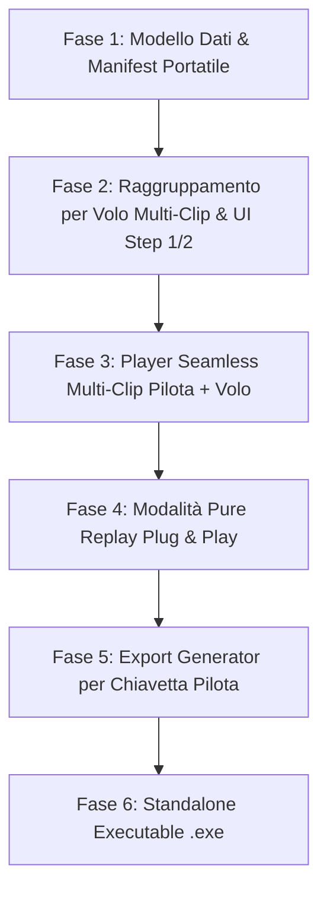

# SIV Video Analyzer - Roadmap Consolidata e Piani di Sviluppo

Questo documento unifica, consolida e riorganizza tutti i piani di sviluppo del progetto **SIV Video Analyzer**, allineandoli alle reali esigenze didattiche dell'istruttore sul campo e alla portabilità su chiavetta USB / multi-computer.

---

## 🎯 Visione Operativa del Progetto

1. **In Volo / Tra i Voli (Debriefing Immediato)**:
   - Zero tempi morti: nessun montaggio video obbligatorio o render lungo.
   - I video della scheda SD vengono catalogati istantaneamente per **Pilota** e per **Numero di Volo** (`Volo 1`, `Volo 2`, ...).
   - **Multi-Clip per Volo**: lo stesso volo può contenere **più clip video consecutive** (es. telecamera accesa/spenta dall'operatore a terra o file splittati a 4GB dalle action-cam come FAT32). Il software le gestisce come un unico volo unificato senza richiedere il rendering.
   - L'istruttore apre il player, seleziona il pilota e il volo appena atterrato e revisiona le manovre con i capitoli già indicizzati.
2. **Portabilità Assoluta (Plug & Play su Chiavetta USB / Altro PC)**:
   - La cartella di output contiene il manifesto del corso (`corso_siv_manifest.json`) con anagrafica piloti, vele e colori.
   - Tutte le trascrizioni e i capitoli sono memorizzati all'interno dell'output: aprendo la chiavetta su un altro PC, tutto è immediatamente pronto senza ri-trascrivere l'audio con Whisper.
3. **Fine Giornata / Fine Corso (Export per i Piloti)**:
   - Produzione su chiavetta dei video per i piloti:
     - Singoli video per ciascun volo (unendo le eventuali multi-clip di quel volo, con capitoli e sottotitoli).
     - Oppure video Master montato con cartelli grafici di transizione tra i voli e sovraimpressione delle manovre.

---

## 🧭 Sequenza Consolidata dei TODO (Roadmap a Fasi)

---

### 🟢 FASE 1: Modello Dati e Portabilità
> **Stato**: ✅ COMPLETATA
- [x] **File Sidecar Portatili `.siv.json` (`core/sidecar_manager.py`)**:
  - Salva pilota, numero di volo, trascrizioni e capitoli direttamente accanto alle clip.
  - Nessuna dipendenza dalla cartella locale: aprendo la cartella su un altro PC i dati sono pronti.

---

### 🟢 FASE 2: Raggruppamento per Volo & UI Registro Voli Live
> **Stato**: ✅ COMPLETATA (Architettura Dual-Mode MD3)
- [x] **Configurazione Piloti & Vele**:
  - Input rapido `Nome - Colore Vela` con memoria persistente (`QSettings`).
- [x] **Calcolo Intelligente Numero di Volo (`core/pilot_detector.py` & `core/flight_grouper.py`)**:
  - Assegnazione automatica tramite comandi radio ("Volo 1", "Volo 2") e `creation_time` FFprobe.
  - Spinbox interattivo per modifica manuale rapida con frecce stilizzate.
- [x] **Tavolo di Lavoro Registro Voli Live (Streaming)**:
  - Tabella in tempo reale che si popola man mano che i video vengono analizzati.

---

### 🟢 FASE 3: Debriefing Immediato & Player Manovre
> **Stato**: ✅ COMPLETATA
- [x] **Player Debriefing Integrato**:
  - Transizione istantanea 1-click tra Tabella Voli e Player senza attendere il termine dell'analisi di tutti i file.
  - Priorità istantanea: se l'istruttore apre un video, il worker calcola subito le manovre di quel video.
- [x] **Capitoli & Note Didattiche**:
  - Timeline interattiva con elenco manovre, timestamp di inizio/fine e comandi radio dell'istruttore.

---

### 🟢 FASE 4: Hub di Esportazione per le Chiavette Piloti
> **Stato**: ✅ COMPLETATA (Funzionalità Base & Batch)
- [x] **Esportazione Video Volo (`core/flight_grouper.py - VideoExporter`)**:
  - Esportazione singolo volo dal Debriefing Player in MP4.
  - Esportazione batch *"📦 Esporta Tutti i Voli"* per tutti i piloti riconosciuti.
  - Unione veloce multi-clip con stream copy FFmpeg (fallback re-encode).
  - Generazione file capitoli YouTube (`*_capitoli.txt`).

---

### 🟡 FASE 5: Ottimizzazioni Esperienza Utente & Avvio (PROSSIMI PASSI)
> **Obiettivo**: Perfezionare la scansione iniziale e consentire l'apertura rapida di sessioni esistenti.

- [ ] **5.1 Rilevamento Intelligente Clip Già Analizzate all'Avvio**:
  - Scansione rapida di `.siv.json` e cache locale.
  - Segnalazione all'istruttore del numero di video già pronti.
  - Opzione per elaborare solo i mancanti senza ri-trascrivere con Whisper.
- [ ] **5.2 Pulsante "📂 Apri Sessione Esistente (Replay)"**:
  - Caricamento istantaneo del Registro Voli da cartelle già elaborate.
- [ ] **5.3 Wing Color Detector (Modulo Opzionale)**:
  - Estrazione automatica colori vela da 2-3 frame chiave (filtraggio cielo HSV).
  - Badge visivo cromatico nella colonna pilota.

---

### 🟡 FASE 6: Standalone Executable (.exe / .app) & Packaging
> **Obiettivo**: Rilasciare un eseguibile standalone pronto all'uso senza dipendere da Python/terminale.

- [ ] **6.1 Configurazione PyInstaller (.spec)**:
  - Inclusione binari FFmpeg, configurazione `siv_maneuvers.json` e modelli Whisper.
- [ ] **6.2 Supporto Multi-Piattaforma (Windows .exe e macOS .app)**.

